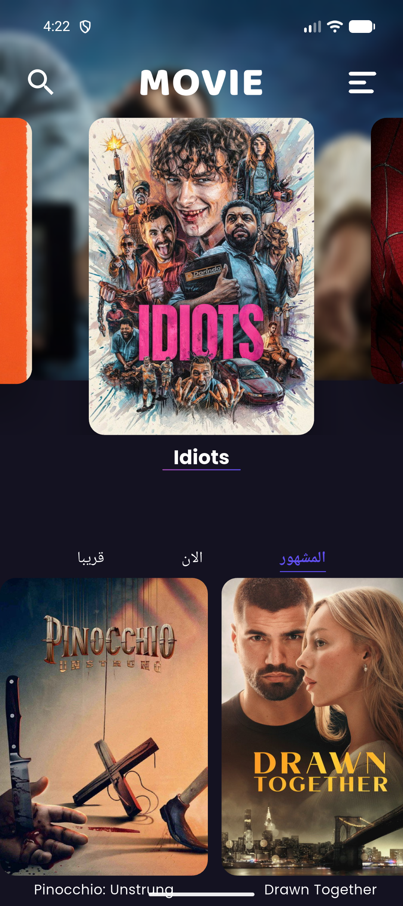
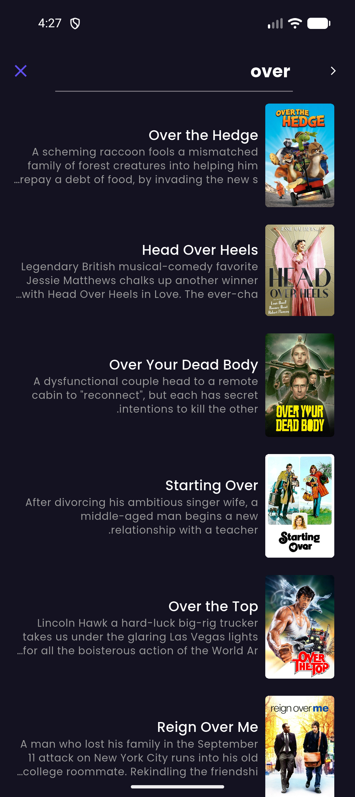
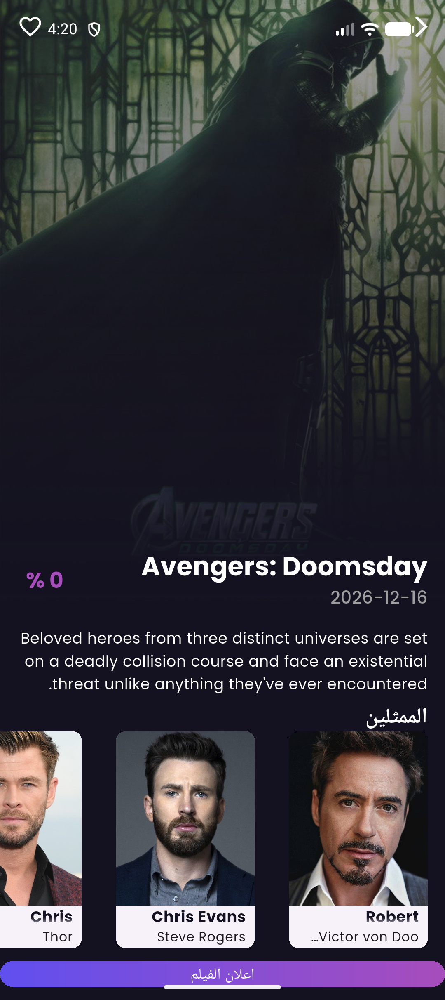
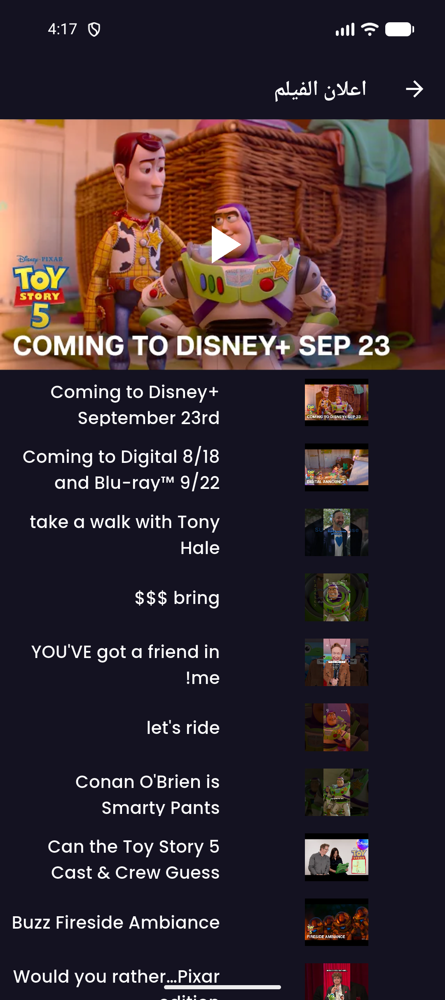
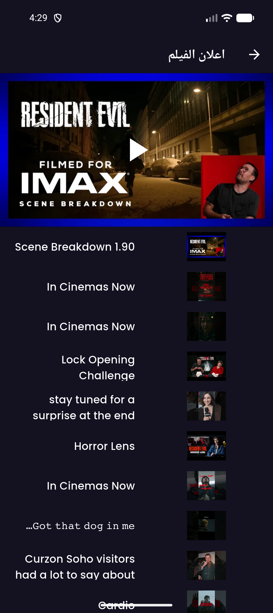
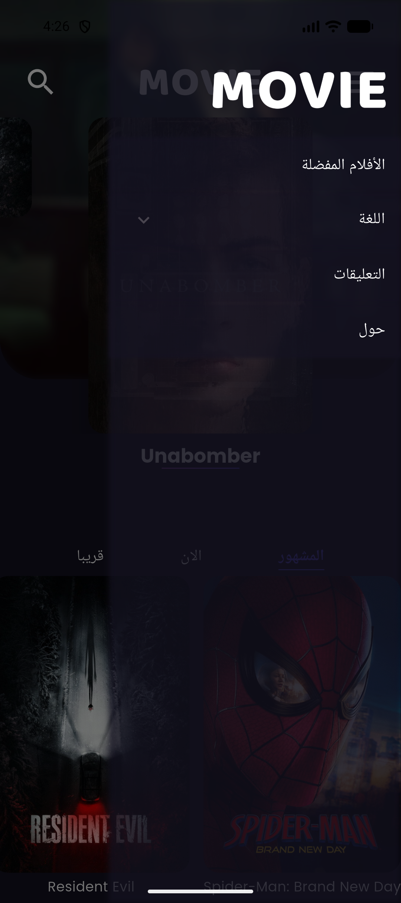
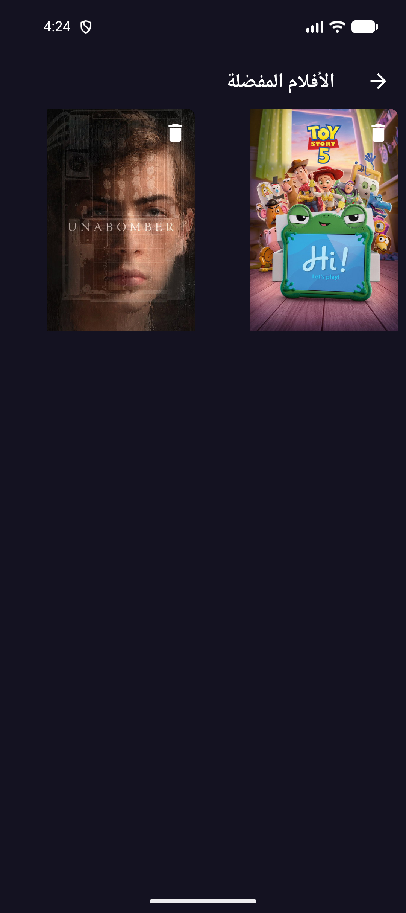
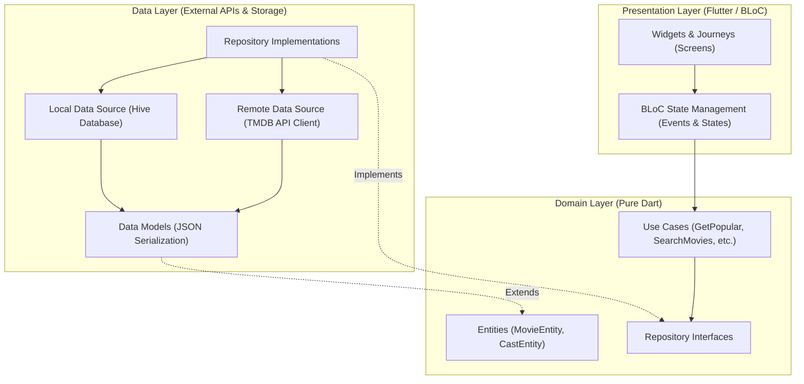

# 🎬 My-Film — Modern Flutter Movie Discovery & Streaming Trailers App

<p align="center">
  
  
  
  
  
  
  
  
</p>

---

## 📖 Overview

**My-Film** is a feature-rich, high-performance cinema and movie discovery mobile application built with **Flutter** following industry-standard **Clean Architecture** and the **BLoC (Business Logic Component)** state management pattern. 

Powered by **The Movie Database (TMDB) API**, the application delivers a cinema-grade visual experience featuring an interactive carousel with dynamic backdrop blurring, real-time movie search, embedded YouTube trailers, offline favorite bookmarks via **Hive NoSQL database**, and complete **bilingual localization (English & Arabic RTL)**.

---

## 📸 Application Screenshots Showcase

> [!NOTE]
> High-resolution walkthrough of the My-Film mobile app showcasing the dynamic hero carousel, instant TMDB search, rich cast and movie details, integrated YouTube trailer player, offline watchlist, and navigation drawer.

### 🌟 Home Discovery & Instant Search
| 🎬 Hero Carousel & Category Tabs | 🔍 Real-time TMDB Movie Search |
| :---: | :---: |
|  |  |
| *Dynamic animated backdrop carousel with Popular, Now Playing & Coming Soon tabs* | *Instant debounce search querying TMDB catalog with rich synopsis & posters* |

### 🍿 Movie Details, Cast & Cinema Trailers
| 📋 Movie Overview & Cast Roster | 🎥 Embedded YouTube Trailers (Toy Story) |
| :---: | :---: |
|  |  |
| *High-res backdrop, rating gauge, synopsis, and interactive cast overview* | *Native in-app YouTube player with comprehensive trailer playlist* |

### 🎞️ Cinematic IMAX Player & Navigation
| 🎬 IMAX Scene Breakdown Player | 🧭 Glassmorphism Navigation Drawer |
| :---: | :---: |
|  |  |
| *Cinematic video player supporting full-screen playback & scene breakdowns* | *Frosted glass drawer with quick access to Favorites, Language, & Feedback* |

### 💖 Offline Watchlist & Favorites
| 💖 Offline Favorites & Bookmarks |
| :---: |
|  |
| *Fast offline storage powered by Hive database with one-tap bookmark toggles* |

---

## ✨ Key Features

- **🎨 Immersive Cinema UI & Animations**:
  - Hero PageView carousel dynamically synchronizing backdrop poster changes with smooth cross-fade transitions.
  - Curated category tabs: **Popular (المشهور)**, **Now Playing (الآن)**, and **Coming Soon (قريباً)**.
  - Modern dark aesthetic tailored for cinematic content consumption.

- **🔍 Intelligent Search**:
  - Live debounce-driven search directly connected to the TMDB API.
  - Dynamic result cards displaying titles, release dates, synopsis, and high-definition poster imagery.

- **📋 Rich Movie Information & Cast**:
  - Complete synopsis, user rating score percentage, release date, and original language.
  - Horizontal cast roster showing actors' headshots, real names, and character roles.

- **🎬 In-App YouTube Trailers Player**:
  - Seamlessly embedded YouTube player powered by `youtube_player_flutter`.
  - Playlist drawer displaying teasers, trailers, featurettes, and scene breakdowns.

- **💾 Offline Favorites (Hive NoSQL)**:
  - Local database caching using Hive for instant read/write operations without network overhead.
  - One-tap add/remove bookmarks with real-time UI state synchronization across screens.

- **🌍 Bilingual & RTL Localization**:
  - Seamless toggle between **English** and **Arabic (العربية)**.
  - Automatic layout mirroring supporting Right-to-Left (RTL) reading direction and Arabic typography.

- **💬 Wiredash In-App Diagnostics**:
  - Built-in feedback and bug reporting integration via Wiredash SDK.

---

## 🏗️ Architecture & Technology Stack

The application strictly implements **Uncle Bob's Clean Architecture** separating concerns into three decoupled layers:



### Core Libraries & Packages
| Package | Version | Purpose |
| :--- | :--- | :--- |
| **`flutter_bloc`** | `^8.1.3` | Predictable state management with unidirectional data flow |
| **`get_it`** | `^6.0.0` | Service locator for dependency injection |
| **`dartz`** | `^0.10.1` | Functional programming utilities (`Either<AppError, Type>`) |
| **`hive`** / **`hive_generator`** | `^2.2.3` | Ultra-fast, lightweight NoSQL offline database |
| **`http`** | `^1.1.0` | REST API client for TMDB endpoints |
| **`cached_network_image`** | `^3.3.0` | High-performance image loading, caching & placeholder handling |
| **`youtube_player_flutter`** | `9.0.0` | Embedded native YouTube playback for trailers |
| **`wiredash`** | `^2.6.1` | User feedback collection and bug triage |
| **`google_fonts`** | `^6.2.1` | Custom typography and typography hierarchies |

---

## 📂 Project Structure

```
movie/
├── assets/
│   ├── pngs/                          # Image assets & illustrations
│   └── svgs/                          # Scalable vector graphics (icons & logos)
│
├── lib/
│   ├── common/
│   │   ├── constants/                 # Route names, translation keys, layout constants
│   │   └── extensions/                # Dart helper extensions
│   │
│   ├── data/                          # Data Layer
│   │   ├── core/                      # API Client & Network Constants (TMDB)
│   │   ├── data_sources/              # Remote & Local data sources (Hive / API)
│   │   ├── models/                    # Data models with JSON deserializers
│   │   ├── repositories/              # Concrete repository implementations
│   │   └── tables/                    # Hive storage entities
│   │
│   ├── domain/                        # Domain Layer (Pure Business Logic)
│   │   ├── entities/                  # Pure business models
│   │   ├── params/                    # Use case parameter objects
│   │   ├── repositories/              # Abstract repository contracts
│   │   └── usecases/                  # Individual granular use cases
│   │
│   ├── presentation/                  # Presentation Layer
│   │   ├── bloc/                      # BLoC controllers (Movies, Search, Favorites, etc.)
│   │   ├── journeys/                  # Feature screens (Home, Search, Details, Drawer)
│   │   ├── themes/                    # Color schemes, typography, and styles
│   │   └── widgets/                   # Reusable atomic UI components
│   │
│   ├── di/                            # Dependency Injection (GetIt service locator setup)
│   ├── l10n/                          # Localization arb files (en, ar)
│   └── main.dart                      # Application bootstrap & initialization
│
├── screenshots/                       # High-resolution showcase screenshots
└── pubspec.yaml                       # Dependencies & asset configuration
```

---

## 🚀 Getting Started

### Prerequisites
- **Flutter SDK**: `>=3.5.0`
- **Dart SDK**: `^3.5.0`
- **Android Studio** or **VS Code** with Flutter & Dart extensions
- Connected Android/iOS device or Emulator

### 1. Clone & Setup
```bash
# Clone the repository
git clone https://github.com/AlsayedAbdelmohiemen/My-Film.git

# Navigate to project directory
cd My-Film

# Install dependencies
flutter pub get
```

### 2. Configure TMDB API Key
The application connects to **The Movie Database (TMDB)**. Configuration is located at:
`lib/data/core/api_constants.dart`

```dart
class ApiConstants {
  ApiConstants._();

  static const String BASE_URL = "https://api.themoviedb.org/3/";
  static const String API_KEY = "YOUR_TMDB_API_KEY_HERE";
  static const String BASE_IMAGE_URL = "https://image.tmdb.org/t/p/w500";
}
```

> [!TIP]
> You can acquire a free TMDB API key by signing up at [themoviedb.org](https://www.themoviedb.org/settings/api).

### 3. Run the Application
```bash
# Run on connected device / emulator
flutter run
```

---

## 👨‍💻 Author & Repository
- **Author**: Sayed Abdelmohiemen
- **GitHub**: [@AlsayedAbdelmohiemen](https://github.com/AlsayedAbdelmohiemen)
- **Repository**: [https://github.com/AlsayedAbdelmohiemen/My-Film](https://github.com/AlsayedAbdelmohiemen/My-Film)

---

## 📄 License
This project is open-source and available under the [MIT License](LICENSE).
